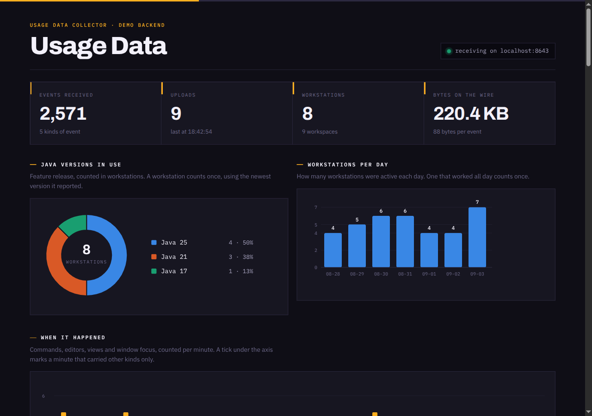
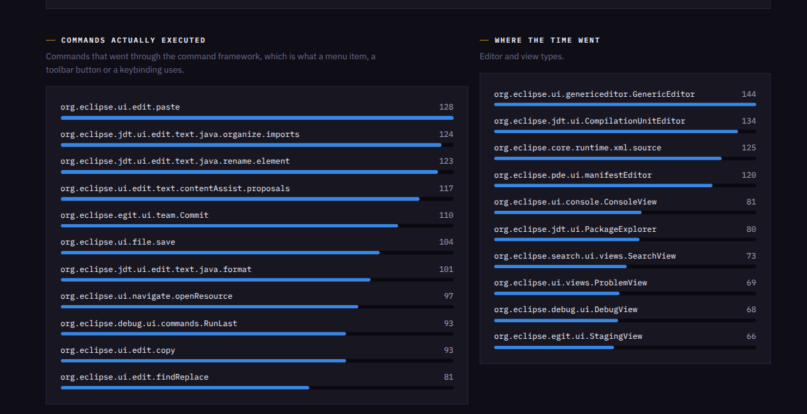
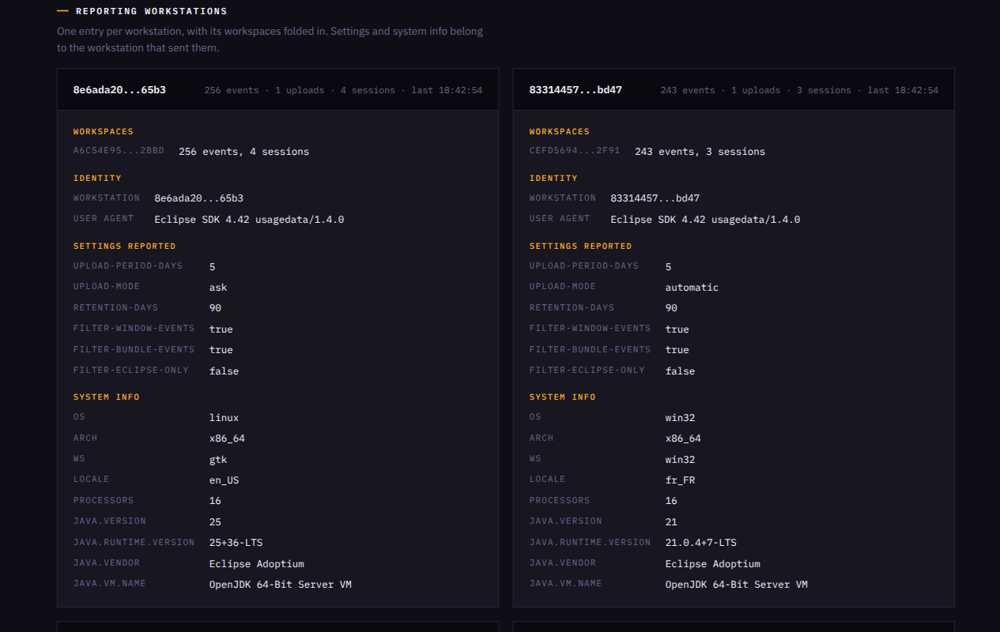

# Usage Data Collector demo backend

A throwaway server that accepts what a real Eclipse IDE uploads and shows it in the browser.
It exists to make the collector demonstrable: start it, press **Upload Now**, watch the data land.

Nothing is written to disk and nothing outlives the process.
It is a demo, not a collector.

## What it looks like

The dashboard after eight workstations reported, with the totals, the Java versions in use and the workstations active per day:



Below that, the commands that were executed and where the time went, by editor and view:



Each reporting workstation gets an entry with its workspaces, the settings it reported and its system info:



## Running it

From the repository root, with Java 21 or later:

```bash
java demo/UdcDemoServer.java
```

The port defaults to 8643 and can be given as the first argument.
The server prints both addresses on startup:

- upload endpoint `http://localhost:8643/upload.php`
- dashboard `http://localhost:8643/`

The dashboard is read from `demo/dashboard.html` on every request, so the page can be edited
without restarting the server.

## Pointing the IDE at it

In **Preferences > Usage Data Collector**:

1. On the *Capture* page, tick **Enable capture**.
   The reachability check runs here, so this is also where a wrong address shows up as a warning.
2. On the *Uploading* page, set **Upload URL** to `http://localhost:8643/upload.php`.
3. Press **Upload Now**.

The server answers 200, which is what tells the IDE the data arrived, so the staged files are
deleted exactly as they would be against a real server.
Uploading again therefore sends only what has been recorded since.

Events are buffered in memory and only written at 25 (`EVENT_COUNT_THRESHOLD`), so a freshly
started IDE may have nothing to send yet.
Opening a few editors and running a few commands is enough.

## What the dashboard shows

| Panel | Reads |
|---|---|
| Tiles | events, uploads, workstations, bytes on the wire |
| Java versions in use | feature release as a donut, counted in workstations rather than events |
| Workstations per day | how many distinct workstations were active on each day |
| When it happened | interaction per minute |
| Commands actually executed | commands that went through the command framework |
| Where the time went | editor and view types |
| Reporting workstations | one entry per workstation, with its workspaces, settings and system info |
| Last events in | the raw CSV rows, newest first |

## Preference reporting

The IDE sends its own configuration as `X-UDC-*` headers, built by
`UsageDataRecordingSettings.getReportedPreferences()`:

```
X-UDC-upload-mode: ask | automatic | manual
X-UDC-upload-period-days: 5
X-UDC-filter-eclipse-only: false
X-UDC-filter-bundle-events: true
X-UDC-retention-days: 90
```

Any header with that prefix is picked up and displayed, so adding a value to the upload needs
no change on the server.
Only how uploading is configured is reported, never anything about the user or what they were doing.

## Sending data without an IDE

Any recorded CSV can be posted directly, which is useful when preparing a demo:

```bash
curl -X POST http://localhost:8643/upload.php \
  -H "USERID: 11111111-2222-3333-4444-555555555555" \
  -H "WORKSPACEID: aaaaaaaa-bbbb-cccc-dddd-eeeeeeeeeeee" \
  -H "TIME: $(date +%s000)" \
  -H "User-Agent: Eclipse/4.41.0 (linux; gtk; x86_64)" \
  -H "X-UDC-upload-mode: automatic" \
  -F "uploads[]=@upload0.csv;filename=upload0.csv"
```

Staged files live in `<workspace>/.metadata/.plugins/org.eclipse.epp.usagedata.recording/`.
